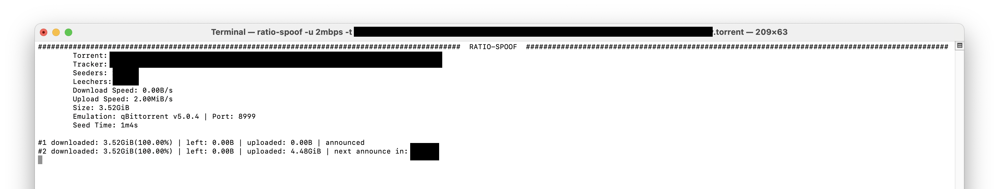

# ratio-spoof
Ratio-spoof is a cross-platform, free and open source tool to spoof the download/upload amount on private bittorrent trackers.



## Original author

**Paulo Afonso Pinheiro:** https://github.com/ap-pauloafonso/ratio-spoof  

## Motivation
Most private trackers require a ratio greater than or equal to 1. For example, if you downloaded 1GB, you must also upload 1GB in order to survive. So, if you have a bad internet connection, feel free to use this tool. Otherwise, please consider seeding the files with a real torrent client.

## How does it work?
Bittorrent protocol works in such a way that there is no way that a tracker knows how much certain peer have downloaded or uploaded, so the tracker depends on the peer itself telling the amounts.

Ratio-spoof acts like a normal bittorrent client but without downloading or uploading anything, in fact it just tricks the tracker pretending that.

## Usage
```
usage: 
	./ratio-spoof -t <TORRENT_PATH> -d <INITIAL_DOWNLOADED>:<DOWNLOAD_SPEED> -u <INITIAL_UPLOADED>:<UPLOAD_SPEED> 

optional arguments:
	-h			show this help message and exit
	-p [PORT]		change the port number, default: 8999
	-c [CLIENT_CODE]	the client emulation, default: qbit-5.0.4
	-wait-leechers		wait for leechers instead of uploading with normal speed
	  
required arguments:
	-t  <TORRENT_PATH>     
	-d  <INITIAL_DOWNLOADED>:<DOWNLOAD_SPEED> 
	-u  <INITIAL_UPLOADED>:<UPLOAD_SPEED> 
	  
<INITIAL_DOWNLOADED> and <INITIAL_UPLOADED> must be in %
<DOWNLOAD_SPEED> and <UPLOAD_SPEED> must be in kbps or mbps
[CLIENT_CODE] options: qbit-4.0.3, qbit-4.3.9, qbit-4.6.5, qbit-5.0.4
```

Examples:

```
./ratio-spoof -t <TORRENT_PATH> -d 90%:500kbps -u 10%:3mbps
```
* Will start "downloading" with the initial value of 90% of the torrent total size at 500 kbps speed until it reaches 100% mark.
* Will start "uploading" with the initial value of 10% of the torrent total size at 3 mbps speed indefinitely.

```
./ratio-spoof -t <TORRENT_PATH> -d 30mbps
```
* Same as `./ratio-spoof -t <TORRENT_PATH> -d 100%:30mbps -u 0%:0kbps`
* Will start "downloading" with the initial value of 100% of the torrent total size at 30 mbps speed.
* Will not upload anything.

```
./ratio-spoof -t <TORRENT_PATH> -u 2mbps
```
* Same as `./ratio-spoof -t <TORRENT_PATH> -d 100%:0kbps -u 0%:2mbps`
* Will start with 100% downloaded.
* Will start "uploading" with the initial value of 0% of the torrent total size at 2 mbps speed indefinitely.

## Building from Source

### Prerequisites
- Go 1.20 or later
- Git

### Steps
1. Clone the repository:
```bash
git clone https://github.com/Acelya-9028/ratio-spoof.git
cd ratio-spoof
```

2. Build the project:
```bash
go build
```

The executable will be created in the current directory.

### Building for Multiple Platforms
To build for multiple platforms (Linux, macOS, and Windows), use the release target:
```bash
make release rsversion=v1.0.0
```
This will create a zip file in the `out` directory containing binaries for all platforms.

## Will I get caught using it ?
Depends on whether you use it carefully, It's a hard task to catch cheaters, but if you start uploading crazy amounts out of nowhere or seeding something with no active leecher on the swarm you may be in risk.

## Bittorrent client supported 
The default client emulation is qbittorrent v5.0.4, however you can change it by using the -c argument

## Resources
http://www.bittorrent.org/beps/bep_0003.html  
https://wiki.theory.org/BitTorrentSpecification
